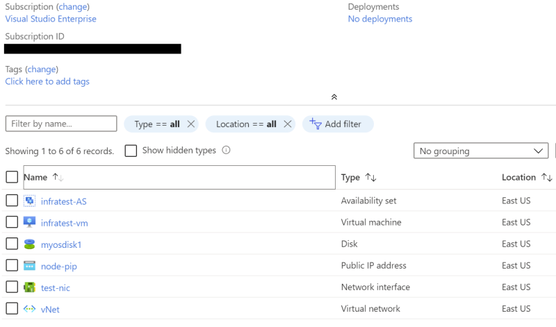
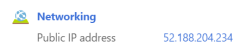

# Azure/Terraform Setup

Setting up Terraform will be a little more work upfront, but will save you lots of work later (and help prevent human errors). 

This assumes you already have an Azure account; if you don't, create one now at (https://azure.microsoft.com/en-us/free/). 

# Install Tools

1. Install [Terraform](https://www.terraform.io/downloads.html).

2. Install [Azure Command Line Interfaces](https://docs.microsoft.com/en-us/cli/azure/install-azure-cli?view=azure-cli-latest).

# Setup for Azure

1. Login to Azure. From the command line, run: `az login`

This will pop up a web interface, allowing you to login. Once successfully logged in, you'll see output similar to the below. 
Copy your subscription id to your favorite notes program. It will look something like "f9234696-4140-2222-face-beef8d17cafe". 
```
[
  {
    "cloudName": "AzureCloud",
    "homeTenantId": "<snip>",
    "id": "<copy this - your subscription id>",
    "isDefault": true,
    "managedByTenants": [],
    "name": "<snip>",
    "state": "Enabled",
    "tenantId": "<snip>",
    "user": {
      "name": "michael@bluthcompany.org",
      "type": "user"
    }
]
```

2. Create a Service Principal (SP):
```
az ad sp create-for-rbac --role="Contributor" --scopes="/subscriptions/<subscription_id>"
```

An SP is a login for a specific service or services. Make sure to replace <subscription_id> with the value you copied in the previous step.
You'll see output similar to the below. And yes, sometimes it has to retry a few times. It's not you, it's them. 

```
Creating a role assignment under the scope of "/subscriptions/f9234696-4140-2222-face-beef8d17cafe"
  Retrying role assignment creation: 1/36
{
  "appId": "72edfeed-972e-291c-b604-63559224333b",
  "displayName": "azure-cli-2020-06-30-16-15-27",
  "name": "http://azure-cli-2020-06-30-16-15-27",
  "password": "c8a352d9-d89d-19b7-fc93-d8a2ddd9ebfe",
  "tenant": "72eee8bf-26f1-71ef-91cb-2d2cd044db47"
}
```

Copy the values for **name**, **password**, and **tenant** to your notes.

3. Login using the Service Principal, replacing -u, -p, and --tenant with values from step 2.

```
az login --service-principal -u http://azure-cli-2020-06-30-16-15-27 -p "c8a352d9-d89d-19b7-fc93-d8a2ddd9ebfe" --tenant "72eee8bf-26f1-71ef-91cb-2d2cd044db47"
```

If successful, you should see your "azure-cli" user logged in now instead of your email address:
```
    <snip>

    "user": {
      "name": "http://azure-cli-2020-06-30-16-15-27",
      "type": "servicePrincipal"
    }  
    <snip>
```

4. Save your environment variables. There are multiple ways to do this, but a quick approach would be:

Windows:
Create a file called **setvars.bat** 
```
set ARM_CLIENT_ID=<appId>
set ARM_CLIENT_SECRET=<password>
set ARM_SUBSCRIPTION_ID=<subscription id>
set ARM_TENANT_ID=<tenant>
```

Linux:
Create a file called **setvars.sh**
```
export ARM_CLIENT_ID=<appId>
export ARM_CLIENT_SECRET=<password>
export ARM_SUBSCRIPTION_ID=<subscription id>
export ARM_TENANT_ID=<tenant>
```

# Setup for Terraform

1. Load in your environment variables.
   
* Windows: `setvars.bat`
* Mac/Linux: `source setvars.sh`

2. Create a new directory somewhere for your Terraform config.

* **Windows**: `mkdir %TMP%\tf-cardano`
* **Mac/Linux**: `mkdir -p $HOME/tmp/tf-cardano`

3. Copy the **cardano-azure-infra.tf** file from the node-setup directory to your new directory, then `cd` to that directory.

4. Edit the cardano-azure-infra.tf file, find this line, and change the password:
```
admin_password = "Password1234!"
```

5. Download the Azure plugin for Terraform and do other prep: `terraform init`

6. Do a "dry run" of Terraform to make sure things look OK: `terraform plan`

7. Create infrastructure in Azure: `terraform apply`

8. Once `terraform apply` completes, visit the [Azure portal](https://portal.azure.com) and check out your new infrastructure.



9. SSH as user `testadmin` to the public IP of the machine, using the password you set in your .tf file in step 4. 
You can find the public IP by clicking into the CardanoInfraTest-rg resource group, then clicking in to the Virtual Machine.



# See Also

* [Microsoft Docs: Quickstart: Getting started with Terraform using Azure Cloud Shell](https://docs.microsoft.com/en-us/azure/developer/terraform/getting-started-cloud-shell).
* [Terraform: Azure Provider: Authenticating using a Service Principal with a Client Secret](https://www.terraform.io/docs/providers/azurerm/guides/service_principal_client_secret.html)
